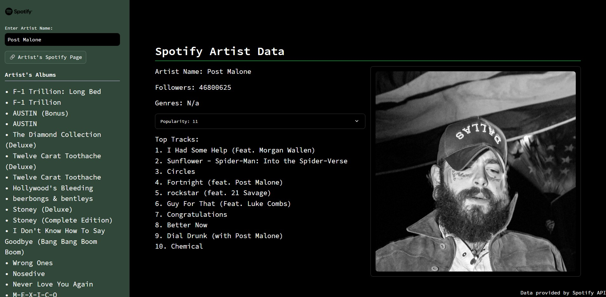

# Spotify Data UI: Spotify Artist Data

A Python application that fetches artist data from Spotify's API and displays relevant information using the **Streamlit** library.

## Features
- Fetches and displays data for artists from Spotify's API.
- Uses **Streamlit** for an interactive and user-friendly interface.
  
## Project Structure
- **`app/`**: Contains the main code and assets for the app.
- **`test/`**: Includes unit tests for the functions within the `app/` folder to ensure functionality.
- **`Dockerfile`**: Adds the addition of running the streamlit app with Docker and can be accessed through localhost

**WebApp Example:**

## Live Demo
You can view the live app [here](https://spotifydataui-wy2w2rhbky8kam3e66jmiv.streamlit.app/).
